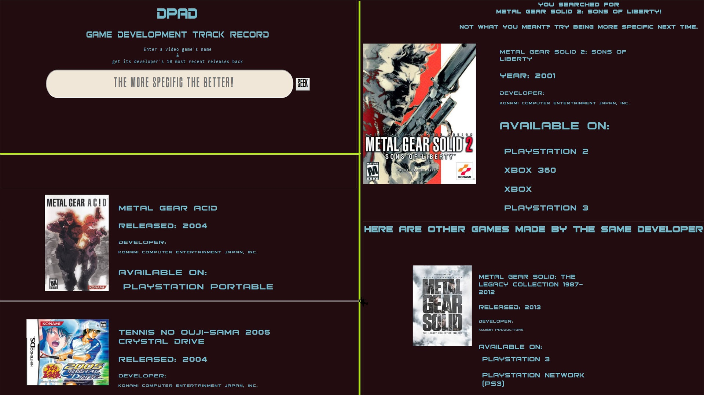

<h1>D-Pad</h1>

<a href='https://lightsage88.github.io/dpad/'>D-PAD</a> is an app that allows you search for a video game title and see up to 10 other entries that that game's developers have made.

##GETTING STARTED
# Use
Visit <a href='https://lightsage88.github.io/dpad/'>this link</a>

<h2>Introduction</h2>

When I'm not coding or singing, I love to play videogames. I am of the camp of gamers that believes videogames can be works of art, equally as capable of presenting a story while reflecting the culture, societal attitudes, and issues of the day as say, for example, a novel, or a really good film. I think one of the first steps for games to achieve that level of acknowledgement in the public consciousness is for people to be made aware of what games developers are making and to get a sense of their track record in terms of what they have produced since and/or before a given title. I created D-Pad as a way to get a sense of this progression.

<h2>How to Use</h2>

It is pretty simple. You just type in the name of a videogame, any videogame. Then you hit the SEEK button and you should get the game you searched for and 10 other games made by the same development company. You will also get information about when the game was released, and what platforms you can play it on.

<h2>Special Notes</h2>

For some titles, like the Metal Gear Solid series, the API (GiantBomb.com) seems to play nice with abbreviations like MGS1 for 'Metal Gear Solid', MGS2 for 'Metal Gear Solid 2'...and so on.

<h2>How it Works</h2>

<h3>Home</h3>

At the home screen, you will be able to type in the name of a videogame and press the search bar.

<h4>Brief Overview</h4>

I used jQuery's AJAX features to make get requests to the GiantBomb.com API. It will seek the game you are searching for, and get a hold of its specific ID in the API. Then it will make note of the development company of the game and get the company's specific API ID. With this in mind, another AJAX request is made to the GB-API for the company's game releases. It will get the 10 most recent ones, minus the one you already searched for, if present, and then put them in an array of objects. After herding some electrons, and pushing a few 0's and 1's about, you'll have all the aforementioned data on screen for your perusal.

<h4>Upon failure to find a game</h4>

If your search yields no results, then a message will pop on screen saying so.

<h2>Technology</h2>
<h3>Front End</h3>
<ul>
  <li>HTML5</li>
  <li>CSS3</li>
  <li>JavaScript</li>
  <li>Jquery</li>
</ul>

<h4>Special Thanks</h4>

Thanks to all the game developers out there and GiantBomb.com!
